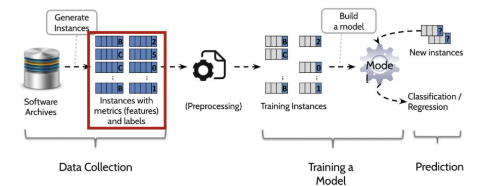

# AG-SZZ

### SUMMARY

본 프로젝트는 한동대학교 ISEL 연구실에서 진행된 Detect Prediction Process(Based on Machine Learning)로 머신러닝에 기반한 버그 감지 프로세스 개발의 첫 단계 부분입니다. 여기서 저희 팀이 진행한 부분은 제일 첫 단계인 ‘Data Collection’단계에서 정확한 Bug-Introducing Change(이하 BIC)를 찾아내는 것입니다. BIC를 찾아내는 SZZ 알고리즘은 현재까지 여러 버전에 의해 개선되었으나, 여전히 완벽한 BIC를 추출해내지 못하며 많은 noise 정보를 담고 있어 false positive의 확률이 높습니다. 기존의 SZZ 알고리즘보다 성능을 12% 향상시켰습니다. 함께 시간을 맞춰 대부분의 개발을 페어 프로그래밍으로 진행하였습니다.

### RESULT

보고서 | https://drive.google.com/file/d/1a-GYWt4hBtty4ISr81Ytln4fbgtINAFF/view

시연영상 | https://www.youtube.com/watch?v=uhfgHhnY4XM

### AWARDS

한동대학교 | 캡스톤 디자인 경진대회 '공학프로젝트 기획'부문 우수상

### PERIOD

2019.08 - 2020.08(12개월)

### DEVELOPER

1. 김석진 (팀장)

   - 설계

   - Tracer 구현

2. 윤지영 (팀원)

   - 설계
   - Build Annotation Graph

### EFFECTS(economical, industrial, and social)

​	한동대학교 ISEL 연구실에서는 Bug Prediction Model을 연구 중에 있다. 이 모델은 머신러닝 기술을 이용해서 commit이 buggy한지 clean한지를 나타내주는 기술인데, 이때Data를 Collection하는 부분(빨간 네모박스) 에서 BIC가 사용된다. 

​	그러나 이때 사용된 BIC는 본 보고서에서도 여러 번 언급되었던 B-SZZ를 통해 찾은 BIC이다. B-SZZ는 높은 false positive 비율을 갖고 있고, 현재 더 발전 되어온 SZZ 알고리즘을 연구하여 적용하기 위해 본 연구가 시작되었다. Data를 collection하는 부분은 core라고 해도 될 만큼 중요한 부분이라 생각한다. 잘못된 data가 input되면 연구의 전반적인 결과에도 영향이 크기 때문이다.
​	뿐만 아니라 소프트웨어에서 testing에 대한 추세가 커짐에 따라 버그를 예측하고 예방하는 것에 대한 중요도가 커지고 있다. 실제 한국에서도 적용 사례가 존재한다. KCSE2020 학회에 참가했을 때 ‘소프트웨어 결함 예측의 조선해양/해상운송 산업 적용 사례 연구’에 대해 들은 적이 있다. 이때도 SZZ 알고리즘이 사용된다는 것을 알게 되었고, 앞으로의 다양한 분야에서도 SZZ 알고리즘은 사용될 수 있다고 생각한다. 아직 활발하게 사용되는 것은 아니지만 앞으로 소프트웨어 공학의 방향을 보았을 때 특히 testing분야나 결함 예측 부분에서 많이 사용될 것이고, 우리의 연구를 통해 개선된 SZZ 알고리즘으로 false positive 비율이 줄어들어 더욱 정확한 연구의 결과를 도출할 수 있다고 생각한다.

(written by 윤지영)